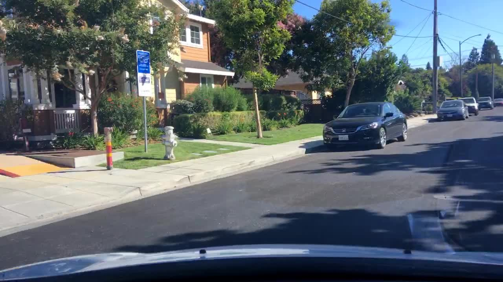
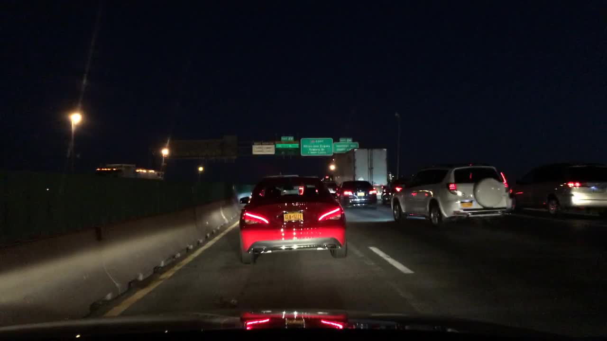
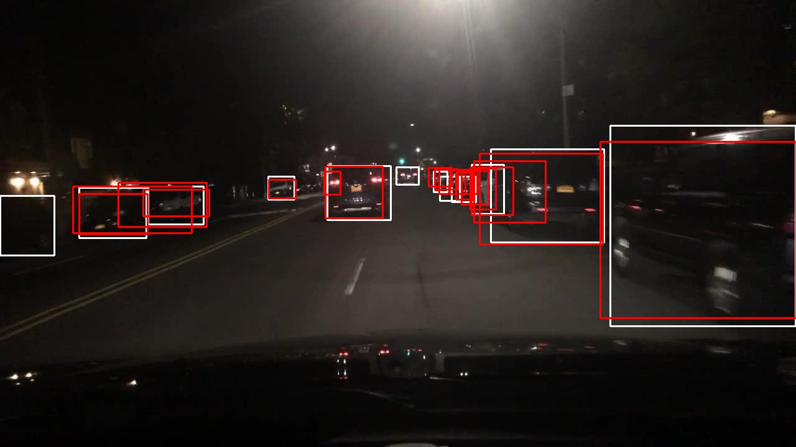
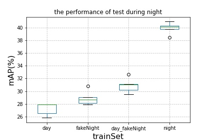
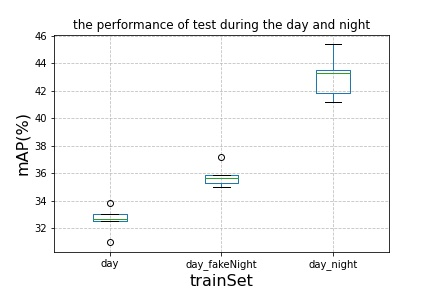
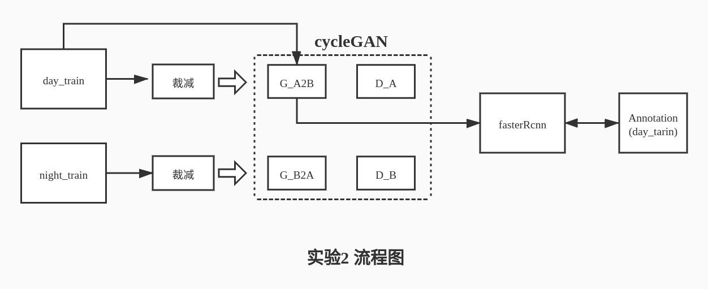

# cross domain object detection
[TOC]

针对目标检测任务中训练集和测试集图像分布不一致，训练集训练的模型在测试集上泛化性能不强的问题。一个直观的解决方案就是通过对测试集打标签并进行训练，但这种方法费时费力，在很大程度上不具备可实施性。

>实验1:首先通过对训练集的图像进行风格迁移，利用风格迁移后的图像进行目标检测模型训练，以求提高模型泛化性能；

>实验2：将风格迁移和目标检测模型融入统一框架，目标检测模型共享风格迁移中生成器A2B的参数，实现两个模块的信息交互；

## 数据集
利用公开数据集[BDD100k](https://bair.berkeley.edu/blog/2018/05/30/bdd/)，由于数据集需通过国外网站下载，速度较慢，故提供[百度云盘下载](https://pan.baidu.com/s/1QqpkOAlsx75YMiBLJGnohw)，密码为：bhnu；该数据集图片大小为1280\*720pixels，包含一天不同时间段的汽车驾驶路况图片，并且每张图片包括如下几个属性：
* 标注：bus,traffic light,traffic sign,person,bike,truck,motor,car,train,rider
* 时间段：daytime,night,dawn/dusk
* 天气：rainy,snowy,clear,overcast,partly cloudy,foggy
* 场景：tunnel,residential,parking lot,city street,gas stations,highway
> 本项实验选择的标注对象为car，以car为过滤条件，选择6000张包含car对象的图片，其中3000张为daytime时间段，另3000张为night时间段，以1500张图片为一个集合，将数据集划分为$day_{train}$、$day_{test}$、$night_{train}$、$night_{test}$四个数据集。

## 实验1
实验分为4项：
1. 数据预处理，过滤具有目标对象car的图片，其中时间段为daytime和night各3000张，分别划分训练集和测试集，各1500张；
   
     
2. 实现cycleGan模型，以$day_{train}$为源域，$night_{train}$为目标域，对$day_{train}$进行风格迁移生成$fakeNight_{train}$。由于风格迁移并不改变其内容位置信息，故其对应的标注信息与$day_{train}$一致；
     
3. 实现fasterRcnn模型，划分5个不同训练集，分别为：$day_{train}$、$day_{train}+fakeNight_{train}$、$day_{train}+night_{train}$、$fakeNight_{train}$、$night_{train}$，每个训练集重复训练5个模型，一共25个模型。测试集分为$day_{test}+night_{test}$、$night_{test}$，利用训练好的模型对测试集进行测试，指标为$mAP$；
   
   > 该图是night测试集中的图片，红色为预测框，白色为真实框，模型是通过fakeNight训练集进行训练。
   
4. 实验效果评估与展示:

    
   
## 实验2
> 由于将风格迁移和目标检测融入统一框架中，同时输入$day_{train}$和$night_{train}$进行模型训练，测试数据集只使用$night_{test}$;

> 本图是实验2的流程图，对于cycleGan模型中具体细节未作刻画，重在描述cycleGan和fasterRcnn的融合及数据流的流动方向。

> 实验结果：mAP跑赢先风格迁移再目标检测的模型平均$mAP$ 4个百分点，达到33.24%；
### cycleGan
1. 数据预处理
   ````
   cd data
   python3 filter_dataset.py
   ````
2. 训练cycleGan
   ````
   bash workflow/cycleGAN_train.sh
   ````
   > 由于cycleGan模型是一个高密集参数训练模型，较一般的深度模型而言，GPU的使用量高1～2个数量级，故对原始1280\*720的图片采用随机裁减到256\*256，加快训练速度。训练记录可见**output/log/cycleGAN_100_4_256_1.txt**
3. 生成$fakeNight_{train}$
   ````
   bash workflow/cycleAN_test.sh
   ````
   > 在测试阶段，由于速度较快，故图片以1280\*720的大小输入，这样输出的图片大小与输入一致，原数据的标注信息也可直接使用。**此阶段图片能以训练阶段不同的大小输入，是由于cycleGan模型采用全卷积**；
### fasterRcnn
1. 训练fasterRcnn模型
   ````
   bash workflow/fasterRcnn_train.sh
   ````
   > fasterRcnn较cycleGan轻量，故使用1280\*720的大小输入，具体参数可通过**workflow/fasterRcnn_train.sh**调试，实验记录可见**output/log/fasterRcnn_训练集名_实验批次.txt**
2. 测试fasterRcnn模型
   ````
   bash workflow/fasterRcnn_test.sh
   ````
   
### 实验2 模型融合
1. 训练融合模型
   ````
   bash workflow/cycleGan_fasterRcnn_train.sh
   ````
   > 实验记录见**output/log/GF.txt**
2. 测试融合模型
   ````
   bash workflow/cycleGan_fasterRcnn_test.sh
   ````

### 实验效果评估与展示
1. mAP测评
   ````
   bash workflow/metric.sh #须手动修改metric.sh中的超参数
   ````

   
   


